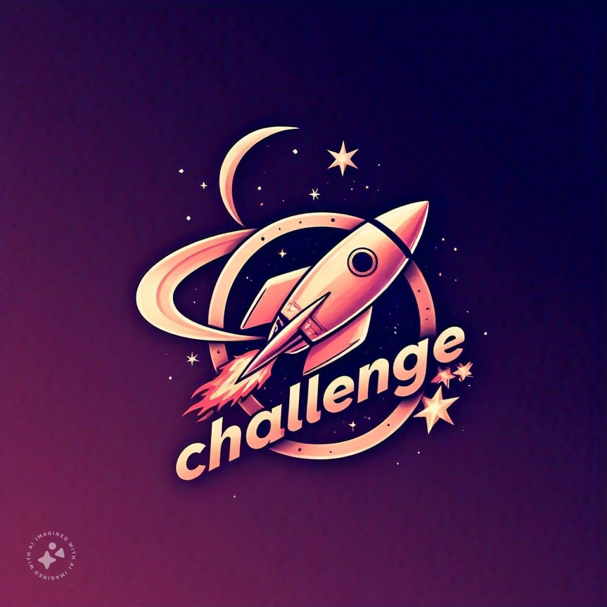

<div align="center" id="top"> 
  

&#xa0;

</div>

<h1 align="center">Nasa Challenge</h1>

<p align="center">
  <a href="#dart-about">About</a> &#xa0; | &#xa0; 
  <a href="#sparkles-features">Features</a> &#xa0; | &#xa0;
  <a href="#rocket-technologies">Technologies</a> &#xa0; | &#xa0;
  <a href="#white_check_mark-requirements">Requirements</a> &#xa0; | &#xa0;
  <a href="#checkered_flag-starting">Starting</a> &#xa0; | &#xa0;
  <a href="#memo-license">License</a> &#xa0; | &#xa0;
  <a href="https://github.com/{{YOUR_GITHUB_USERNAME}}" target="_blank">Author</a>
</p>

<br>

## :dart: About

Desafio Flutter para empresa eclipseworks

## :sparkles: Features

:heavy_check_mark: Obter imagens ou videos de uma api da nasa;

## :rocket: Technologies

- [Flutter](https://flutter.dev/)

## :white_check_mark: Requirements

Flutter instalado na máquina com versão 3.27.1

## :checkered_flag: Starting

Segue abaixo modelo do arquivo `.env` que deve ser criado na raiz do projeto.

```bash
URL_BASE=https://api.nasa.gov/
STATIC_TOKEN=API_KEY
```

</br>

<table>
  <tr>
    <td align="center"><a href="https://github.com/jhonathanqz"><br /><sub><b>Jhonathan C. Queiroz</b></sub></a><br /> <a href="https://github.com/jhonathanqz" title="Autor">😎</a></td>
  </tr>
  
</table>

Feito por <a href="https://github.com/jhonathanqz" target="_blank">Jhonathan Queiroz</a>

&#xa0;

<a href="#top">Back to top</a>
